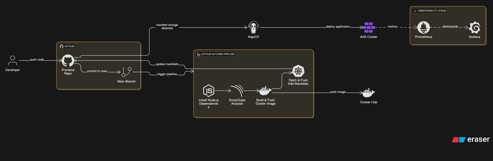

# QR Code Generator (Next.js + FastAPI + Kubernetes)

## 🚀 Overview

A full-stack QR Code Generator deployed on Azure Kubernetes Service (AKS). It uses a FastAPI backend to generate QR codes for submitted URLs and a Next.js frontend to interact with users.

---

## 🧱 Architecture

```
Browser (HTTPS)  
   ↕  
[Ingress NGINX]  
   ↕  
┌──────────────┬──────────────┐
│ Frontend App │  Backend API │
│ (Next.js)    │ (FastAPI)    │
└──────────────┴──────────────┘
   ↕               ↕
[ Azure SQL ]     [ Dockerized ]
   ↕               ↕
 Monitoring Stack (Prometheus, Loki, Grafana)
```

---

## 🧰 Tech Stack

* **Frontend**: Next.js (React-based)
* **Backend**: FastAPI (Python)
* **Database**: Azure SQL (for storing QR code Base64 data)
* **Containerization**: Docker
* **Kubernetes**: Deployed on AKS
* **Ingress**: NGINX Ingress Controller
* **Observability**: Prometheus, Grafana
* **CI/CD**: GitHub Actions + ArgoCD

---

## 📁 Project Structure

```
qrcodegenerator/
├── backend/                  # FastAPI application
├── frontend/                 # Next.js application
├── k8s/                      # Kubernetes manifests
│   ├── api-deployment.yml
│   ├── frontend-deployment.yml
│   ├── ingress.yml
│   └── monitoring-ingress.yml
└── .github/workflows/       # GitHub Actions CI pipelines

```

---

## 🧪 Local Development

### 🖥️ Frontend

```bash
cd frontend
npm install
npm run dev
```

URL: `http://localhost:3000`

### ⚙️ Backend

```bash
cd backend
pip install -r requirements.txt
uvicorn main:app --reload
```

URL: `http://localhost:8000/generate-qr/`

---

## ☁️ Kubernetes Deployment (AKS)

### Apply App Deployments

```bash
kubectl apply -f k8s/api-deployment.yml
kubectl apply -f k8s/frontend-deployment.yml
kubectl apply -f k8s/ingress.yml
```

### Ingress Configuration

```yaml
# ingress.yml
- host: api.<IP>.nip.io  -> api service
- host: app.<IP>.nip.io  -> frontend service
```

---

## 🔍 Monitoring & Observability

### 📊 Prometheus + Grafana

* **Data source**: Prometheus added in Grafana
* **Dashboards**:

  * Kubernetes Metrics (`ID: 6417`)
  * Node Exporter (`ID: 1860`)

### Monitoring Ingress

```yaml
# monitoring-ingress.yml
- host: grafana.<IP>.nip.io
- host: prometheus.<IP>.nip.io
```

---

## 🔧 CI/CD

* **CI**: GitHub Actions handles lint, test, build, Docker image push
* **CD**: ArgoCD pulls manifests and applies them to AKS


---

## 🧠 Troubleshooting

| Issue                        | Fix                                            |                                   |
| ---------------------------- | ---------------------------------------------- | --------------------------------- |
| 404 on `/generate-qr/`       | Rewrite rule with regex \`/api(/               | \$)(.\*)`+`rewrite-target: /\$2\` |
| Grafana 404                  | Add `GF_SERVER_ROOT_URL` in env vars           |                                   |
| Logs missing in Grafana      | Check Loki/Promtail setup, verify labels       |                                   |
| Load balancer not forwarding | Check health probe `/healthz` returns `200 OK` |                                   |

---

### 📈 Future Enhancements
## 📦 Loki + Promtail

* Logs sent from pods to Loki
* View logs via **Explore** tab in Grafana

* [ ] HTTPS via cert-manager + Let's Encrypt
* [ ] Alerting rules in Prometheus
* [ ] Blackbox monitoring for frontend
* [ ] User auth for frontend (optional)

---

## 📜 License

MIT License

---

## 🔗 Author

[Pranay Jujjuri](https://github.com/gitpranay5)
